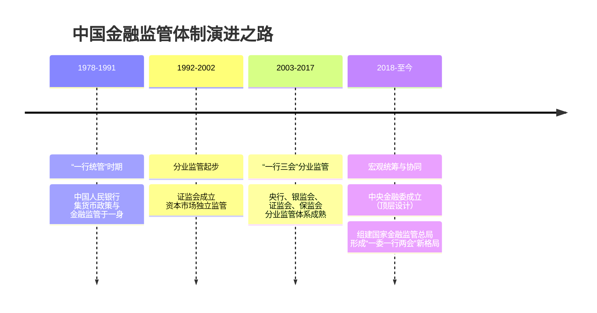

```mermaid
timeline
    title 中国金融监管体制演进之路
    1978-1991 : “一行统管”时期
              : 中国人民银行<br>集货币政策与<br>金融监管于一身
    1992-2002 : 分业监管起步
              : 证监会成立<br>资本市场独立监管
    2003-2017 : “一行三会”分业监管
              : 央行、银监会、<br>证监会、保监会<br>分业监管体系成熟
    2018-至今 : 宏观统筹与协同
              : 中央金融委成立<br>（顶层设计）
              : 组建国家金融监管总局<br>形成“一委一行两会”新格局
```